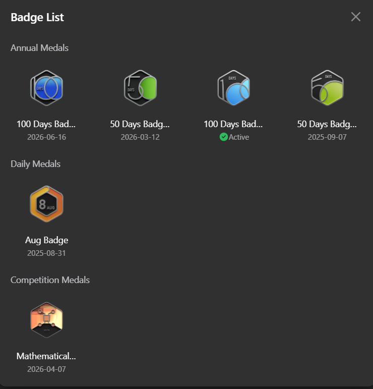
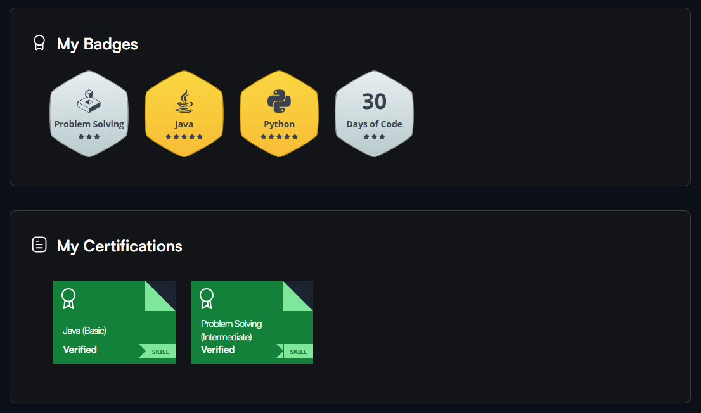

<div align="center">


<br>


<br><br>

<sub>
<strong>BUILDING</strong> · <strong>LEARNING</strong> · <strong>SOLVING</strong>
</sub>

<br><br>

<a href="https://github.com/vijayalakshmi-129">

</a>
&nbsp;
<a href="https://leetcode.com/u/vijayalakshmi_7/">

</a>
&nbsp;
<a href="https://www.hackerrank.com/profile/vijayalakshmics4">

</a>
&nbsp;
<a href="https://www.linkedin.com/in/vijayalakshmi9390/">

</a>

<br><br>

<sub>Turning ideas into code and challenges into solutions.</sub>

</div>

---

## 👩‍💻 About Me

I'm **Vijayalakshmi**, an aspiring software developer interested in **software engineering, AI, and problem solving**.

I enjoy turning ideas into working applications and learning how different technologies work together — from frontend interfaces and backend APIs to databases and machine-learning systems.

Currently, I'm focused on strengthening my **programming fundamentals, DSA, full-stack development, and AI skills** by building projects and solving problems.

---

## 🛠️ Technologies

### Languages

`C` `Java` `Python` `JavaScript` `HTML` `CSS` `PHP`

### Full Stack Development

`React` `Vite` `Node.js` `Express.js` `MongoDB` `Tailwind CSS`

### AI / Machine Learning

`Generative AI` `Machine Learning` `Computer Vision` `YOLOv8` `Roboflow`

### Core Skills

`Data Structures & Algorithms` `OOPs` `Problem Solving`

### Tools

`Git` `GitHub` `Docker` `VS Code` `Google Colab`

---

## 💼 Experience

<table>
<tr>

<td width="33%" align="center">

### Web Development

**Coginfyz Technologies**

`1 Month`

</td>

<td width="33%" align="center">

### Full Stack Development

**Nandha Infotech**

`14 Days`

</td>

<td width="33%" align="center">

### Generative AI

**Shell Code**

`14 Days`

</td>

</tr>
</table>

---

## 🚀 Selected Work

### 🏋️ Jaihind Sports Fit

**Sports & Fitness Website · Web Development**

A sports and fitness website created to provide information and services through a clean, user-friendly web experience.

🌐 **Live Website:** [jaihindsportsfit.in](https://jaihindsportsfit.in)

### 🍎 Fruit Freshness Detection & Shelf-Life Recommendation

**Computer Vision · YOLOv8 · Python · Roboflow**

A computer-vision project that detects fresh and rotten fruits and provides shelf-life recommendations based on the detected freshness condition.

**Workflow**

`Dataset` → `YOLOv8 Training` → `Fruit Detection` → `Freshness Classification` → `Shelf-Life Recommendation`

### 🍽️ Smart Canteen

**Web Application · Full Stack Development**

A smart canteen project designed to improve the canteen ordering experience and make food management more convenient through a digital platform.
## 🚀 Selected Work

### 🏋️ Jaihind Sports Fit

**Sports & Fitness Website · Web Development**

A sports and fitness website created to provide information and services through a clean, user-friendly web experience.

🌐 **Live Website:** [jaihindsportsfit.in](https://jaihindsportsfit.in)

### 🍎 Fruit Freshness Detection & Shelf-Life Recommendation

**Computer Vision · YOLOv8 · Python · Roboflow**

A computer-vision project that detects fresh and rotten fruits and provides shelf-life recommendations based on the detected freshness condition.

**Workflow**

`Dataset` → `YOLOv8 Training` → `Fruit Detection` → `Freshness Classification` → `Shelf-Life Recommendation`

### 🍽️ Smart Canteen

**Web Application · Full Stack Development**

A smart canteen project designed to improve the canteen ordering experience and make food management more convenient through a digital platform.
## 🚀 Selected Work

### 🏋️ Jaihind Sports Fit

**Sports & Fitness Website · Web Development**

A sports and fitness website created to provide information and services through a clean, user-friendly web experience.

🌐 **Live Website:** [jaihindsportsfit.in](https://jaihindsportsfit.in)

### 🍎 Fruit Freshness Detection & Shelf-Life Recommendation

**Computer Vision · YOLOv8 · Python · Roboflow**

A computer-vision project that detects fresh and rotten fruits and provides shelf-life recommendations based on the detected freshness condition.

**Workflow**

`Dataset` → `YOLOv8 Training` → `Fruit Detection` → `Freshness Classification` → `Shelf-Life Recommendation`

### 🍽️ Smart Canteen

**Web Application · Full Stack Development**

A smart canteen project designed to improve the canteen ordering experience and make food management more convenient through a digital platform.

---

## 💻 Coding Profiles

<table>
<tr>

<td align="center" width="33%">

<a href="https://leetcode.com/u/vijayalakshmi_7/">


### LeetCode

*Problem Solving*

Click to visit profile →

</a>

</td>

<td align="center" width="33%">

<a href="https://www.hackerrank.com/profile/vijayalakshmics4">


### HackerRank

*Programming Practice*

Click to visit profile →

</a>

</td>

<td align="center" width="33%">

<a href="https://github.com/vijayalakshmi-129">


### GitHub

*Projects & Code*

Click to visit profile →

</a>

</td>

</tr>
</table>

</div>


## 🏆 Coding Milestones

### 🟢 LeetCode

<p align="center">

<a href="https://leetcode.com/u/vijayalakshmi_7/">



</a>

</p>

<p align="center">

<b>570+ Problems Solved</b>

</p>

---

### 🟠 HackerRank

<p align="center">

<a href="https://www.hackerrank.com/profile/vijayalakshmics4">



</a>

</p>

<p align="center">

<b>Badges:</b> Problem Solving · Java · Python · Days of Code

</p>


## 🌱 Currently Exploring

<div align="center">


<br><br>

<table>
<tr>

<td align="center">
🤖<br>
<b>Generative AI</b>
</td>

<td align="center">
🌐<br>
<b>Full Stack</b>
</td>

<td align="center">
☕<br>
<b>Java & DSA</b>
</td>

</tr>

<tr>

<td align="center">
🧠<br>
<b>Problem Solving</b>
</td>

<td align="center">
🔬<br>
<b>Machine Learning</b>
</td>

<td align="center">
💻<br>
<b>OOPs</b>
</td>

</tr>
</table>

<br>

<sub>
Learning by building. Improving by solving.
</sub>

</div>

---

## 📊 GitHub Activity

<div align="center">


<br><br>


</div>

---

## 🎯 What I'm Working Towards

I don't want to just collect technologies.

I want to **understand them, build with them, and use them to solve real problems.**

```text
LEARN → BUILD → BREAK → DEBUG → IMPROVE
```

---

<div align="center">

## Let's Connect

<a href="https://www.linkedin.com/in/vijayalakshmi9390/">

</a>

 

<a href="https://github.com/vijayalakshmi-129">

</a>

 

<a href="https://leetcode.com/u/vijayalakshmi_7/">

</a>

 

<a href="https://www.hackerrank.com/profile/vijayalakshmics4">

</a>

<br><br>

<sub>© Vijayalakshmi · Building one step at a time.</sub>

</div>
